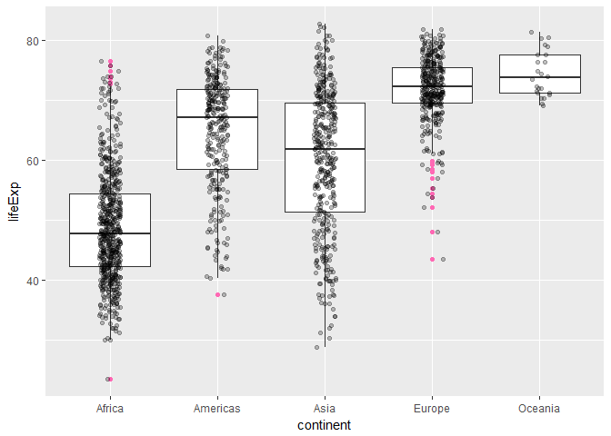
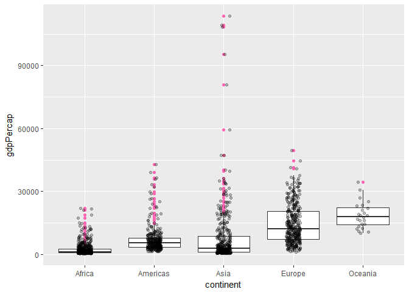
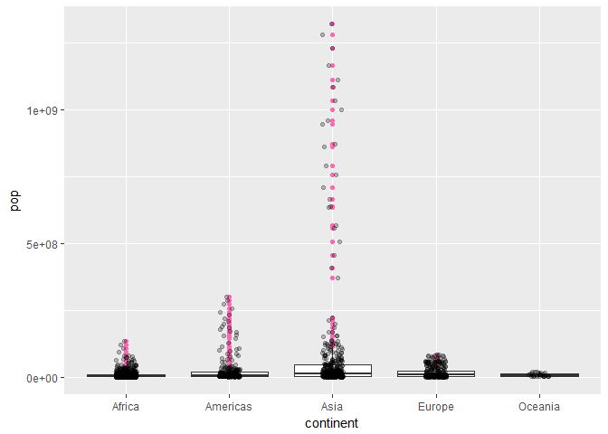
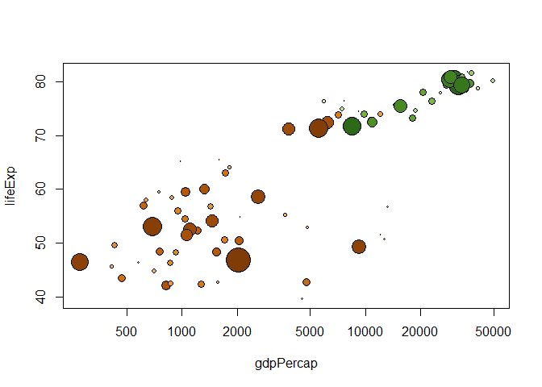
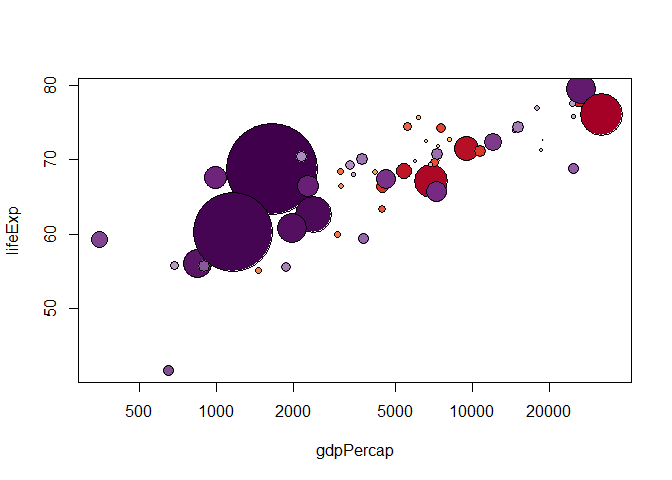

Homework 01 Report
================
Jacqueline Mix
January 23, 2017

**Homework 01 SETUP**
---------------------

1.  Create a Github repository for N741 Homework 1. Initialize it with a README file.
2.  In RStudio, create a new project for N741 Homework 1.
3.  Link RStudio to your Github repository for N741 homework 1.

Gapminder Example
-----------------

The following report is based on the R code examples at the **Gapminder** Github repository located at <https://github.com/jennybc/gapminder>.

Gapminder dataset - summary statistics
--------------------------------------

The `gapminder` dataset which is built into the `gapminder` package, has 6 variables and 1704 observations. We can list the variables in the dataset, using the `names()` function.

### Variables (columns) in gapminder dataset

``` r
names(gapminder)
```

    ## [1] "country"   "continent" "year"      "lifeExp"   "pop"       "gdpPercap"

### Structure of the gapminder dataset

Another way to see the "structure" of the dataset is to run the `str()` function.

``` r
str(gapminder)
```

    ## Classes 'tbl_df', 'tbl' and 'data.frame':    1704 obs. of  6 variables:
    ##  $ country  : Factor w/ 142 levels "Afghanistan",..: 1 1 1 1 1 1 1 1 1 1 ...
    ##  $ continent: Factor w/ 5 levels "Africa","Americas",..: 3 3 3 3 3 3 3 3 3 3 ...
    ##  $ year     : int  1952 1957 1962 1967 1972 1977 1982 1987 1992 1997 ...
    ##  $ lifeExp  : num  28.8 30.3 32 34 36.1 ...
    ##  $ pop      : int  8425333 9240934 10267083 11537966 13079460 14880372 12881816 13867957 16317921 22227415 ...
    ##  $ gdpPercap: num  779 821 853 836 740 ...

You'll notice that the 1st 2 columns/variables "country" and "continent" are both "Factor" type variables. Variables 3 and 5 "year" and "pop" are both "int" Integer type variables. Variables 4 and 6 "lifeExp" and "gdpPercap" are both "num" Numeric type variables.

### Summary Statistics of the gapminder dataset

The built in function `summary()` in base R does a good simple summary statistics for all variables in the dataset provided. Since this dataset only has 6 variable, we can simply call `summary(gapminder)` which will give us the summary statistics for all 6 variables.

``` r
summary(gapminder)
```

    ##         country        continent        year         lifeExp     
    ##  Afghanistan:  12   Africa  :624   Min.   :1952   Min.   :23.60  
    ##  Albania    :  12   Americas:300   1st Qu.:1966   1st Qu.:48.20  
    ##  Algeria    :  12   Asia    :396   Median :1980   Median :60.71  
    ##  Angola     :  12   Europe  :360   Mean   :1980   Mean   :59.47  
    ##  Argentina  :  12   Oceania : 24   3rd Qu.:1993   3rd Qu.:70.85  
    ##  Australia  :  12                  Max.   :2007   Max.   :82.60  
    ##  (Other)    :1632                                                
    ##       pop              gdpPercap       
    ##  Min.   :6.001e+04   Min.   :   241.2  
    ##  1st Qu.:2.794e+06   1st Qu.:  1202.1  
    ##  Median :7.024e+06   Median :  3531.8  
    ##  Mean   :2.960e+07   Mean   :  7215.3  
    ##  3rd Qu.:1.959e+07   3rd Qu.:  9325.5  
    ##  Max.   :1.319e+09   Max.   :113523.1  
    ## 

### Run specific statistic for a given variable

Suppose we only wanted to get the *mean* life expectancy. To do this we can use the built-in function `mean()`. To select only the "lifeExp" variable, we can either refer to it by which column it is in the dataset using `gapminder[,4]` which says to select all rows by leaving the 1st element between the `[]` before the comma blank and putting a 4 after the comman which specifies the 4th column. Another way to select a column is to use the name of that column which is "lifeExp" and use the dollar sign `$` selector to get `gapminder$lifeExp`.

``` r
mean(gapminder$lifeExp)
```

    ## [1] 59.47444

### In line code

We can use the same command above, but call it "inline" instead of as a separate code chunk which sets the output apart from the text in a separate section of the report. If you simply want the computation executed and the result inserted into the body of text you are writing you use "inline" code. To do this you use the following syntax *r mean(gapminder$lifeExp)* between the backtick marks \` \`. Using this syntax, we can write the following sentence.

The mean life expectancy is 59.4744394 years.

We can clean this up further by wrapping this command within the `round()` function and specifying the number of digits we want reported for this numeric result. This time, use the following command inline *r round(mean(gapminder$lifeExp), digits=2)* and we'll rewrite the sentence below.

The mean life expectancy is 59.47 years.

### **Homework 01 Exercise - Task 1**

Modify the sentence above to also provide the standard deviation, median and sample size for life expectancy, set `digits=2`.

Hint: Read help pages for the functions `sd()`, `median()`, and `length()`.

### Answer Homework 01 Task 1\*\*

The standard deviation of the mean life expectancy is 12.92 years.

The median life expectancy is 60.71 years.

The sample size is n = 1704

### Look at a statistic by continent

Using the 1st code example at the `gapminder` Github repository at <https://github.com/jennybc/gapminder>, use the `aggregate()` command to see the median life expectancy by continent. You'll notice that the 1st variable listed is the "lifeExp" variable we want run "by" "continent". The "by" is indicated using the *tilde* symbol `~`. The 2nd variable listed is "continent" - this 2nd variable is usually a "factor-type" variable or group variable. *Hint: Try running lifeExp by year to get median lifeExp for each year.*

``` r
aggregate(lifeExp ~ continent, gapminder, median)
```

    ##   continent lifeExp
    ## 1    Africa 47.7920
    ## 2  Americas 67.0480
    ## 3      Asia 61.7915
    ## 4    Europe 72.2410
    ## 5   Oceania 73.6650

### **Homework 01 Exercise - Task 2**

Modify the r code chunk above to also provide the mean and standard deviation for life expectancy by continent.

### **Answer to Homework 01 Exercise - Task 2**

``` r
aggregate(lifeExp ~ continent, gapminder, mean)
```

    ##   continent  lifeExp
    ## 1    Africa 48.86533
    ## 2  Americas 64.65874
    ## 3      Asia 60.06490
    ## 4    Europe 71.90369
    ## 5   Oceania 74.32621

``` r
aggregate(lifeExp ~ continent, gapminder, sd)
```

    ##   continent   lifeExp
    ## 1    Africa  9.150210
    ## 2  Americas  9.345088
    ## 3      Asia 11.864532
    ## 4    Europe  5.433178
    ## 5   Oceania  3.795611

### Plot Life Expectancy by Continent

For the following plot, we will use the `ggplot2` package. Please be sure to install the package if you haven't already. Go to RStudio "Tools" menu and select "Install Packages" and type in "ggplot2". The R code chunk below will load the `ggplot2` package using the `library(ggplot2)` command. For now, we are using the code provided at the **Gapminder** Github repository located at <https://github.com/jennybc/gapminder>. We will explore and explain the ggplot syntax in further detail later this semester. For now, notice that in the `aes()` section of code below, there are 2 "aesthetics" provided to `ggplot()` - namely that `x = continent` and `y = lifeExp`. The code below generates 2 plots overlaid on top of each other. The 1st is a boxplot generated by `geom_boxplot` and then a 2nd plot of "jittered" points is overlaid using the `geom_jitter()` command.

``` r
library(ggplot2)
ggplot(gapminder, aes(x = continent, y = lifeExp)) +
  geom_boxplot(outlier.colour = "hotpink") +
  geom_jitter(position = position_jitter(width = 0.1, height = 0), alpha = 1/4)
```



### **Homework 01 Exercise - Task 3**

Modify the R code chunk above to now produce two more plots: one for `gdpPercap` instead of `lifeExp` and one for `pop` instead of `lifeExp`. *Hint: change out the variable for `y` above. You will need the entire code chunk run twice - once for each different plot.*

### **Answer to Homework 01 Exercise - Task 3**

``` r
library(ggplot2)
ggplot(gapminder, aes(x = continent, y = gdpPercap)) +
  geom_boxplot(outlier.colour = "hotpink") +
  geom_jitter(position = position_jitter(width = 0.1, height = 0), alpha = 1/4)
```



``` r
library(ggplot2)
ggplot(gapminder, aes(x = continent, y = pop)) +
  geom_boxplot(outlier.colour = "hotpink") +
  geom_jitter(position = position_jitter(width = 0.1, height = 0), alpha = 1/4)
```



### Selecting a Data subset and Customizing Plot Colors

For this next example, we will use the built-in "country\_colors" dataset defined in the `gapminder` package to create an updated data frame (cope of the `gapminder` dataset) called `gap_with_colors`. *NOTE: To see the built-in datasets in the `gapminder` package, type `data(package = "gapminder")` in the console.* After setting up the custom colors, the next line of R code defines which continents we plan to "keep" in our plot. This defines and object called `keepers` below. In this case, we are "keeping" Africa and Europe and the year 2007. So, we are subsetting the dataset for 2 countries and 1 year. Then the `plot()` command creates the scatterplot of life expectancy by GDP per capita with a dot representing each county within 2 continents (Africa and Europe) for only 2007. The size of each dot is represents a 3rd variable "pop" for population size.

``` r
# for convenience, integrate the country colors into the data.frame
gap_with_colors <-
  data.frame(gapminder,
             cc = I(country_colors[match(gapminder$country,
                                         names(country_colors))]))

# bubble plot, focus just on Africa and Europe in 2007
keepers <- with(gap_with_colors,
                continent %in% c("Africa", "Europe") & year == 2007)
plot(lifeExp ~ gdpPercap, gap_with_colors,
     subset = keepers, log = "x", pch = 21,
     cex = sqrt(gap_with_colors$pop[keepers]/pi)/1500,
     bg = gap_with_colors$cc[keepers])
```



### **Homework 01 Exercise - Task 4**

Modify the code chunk above to make a bubble plot for 2 other continents: Americas and Asia for the year 1992. *Hint: modify the variables listed in the "keepers" line of code for the 2 countries and the year.*

### **Answer Homework 01 Exercise - Task 4**

``` r
# for convenience, integrate the country colors into the data.frame
gap_with_colors <-
  data.frame(gapminder,
             cc = I(country_colors[match(gapminder$country,
                                         names(country_colors))]))

# bubble plot, focus just on Africa and Europe in 2007
keepers <- with(gap_with_colors,
                continent %in% c("Americas", "Asia") & year == 1992)
plot(lifeExp ~ gdpPercap, gap_with_colors,
     subset = keepers, log = "x", pch = 21,
     cex = sqrt(gap_with_colors$pop[keepers]/pi)/1500,
     bg = gap_with_colors$cc[keepers])
```



### **Homework 01 Exercise - Task 5**

-   For your report, modify the YAML to put a good TITLE for your report and put in YOUR NAME and change the DATE.
-   If you have MiKTeX or MacTex installed and running on your computer, you can compile the report directly to PDF ("Knit to PDF"). However, if you didn't install these, you should still be able to "Knit to HTML" or "Knit to Word". Once you've got the HTML or Microsoft Word DOCX file created, you can print these to PDF.
-   Make sure your report completes the 4 tasks above with your associated R chunks along with a description or commentary on what you did and the result.
-   Submit the PDF homework using Canvas for N741.
-   Include in your report a link to your Github repository with your RMD file and any other associated output you created. In the body of your Rmarkdown (RMD) report use the `[]()` syntax to embed the URL "web link". For example, the link for this exercise is located at <https://github.com/melindahiggins2000/N741gapminder1> which was typed in to the Rmarkdown file as `[https://github.com/melindahiggins2000/N741gapminder1](https://github.com/melindahiggins2000/N741gapminder1)`.

### **Answer Homework 01 Exercise - Task 5**

the link for this exercise is located at \[<https://github.com/JaxMix/N741gapminder1.git>\]
